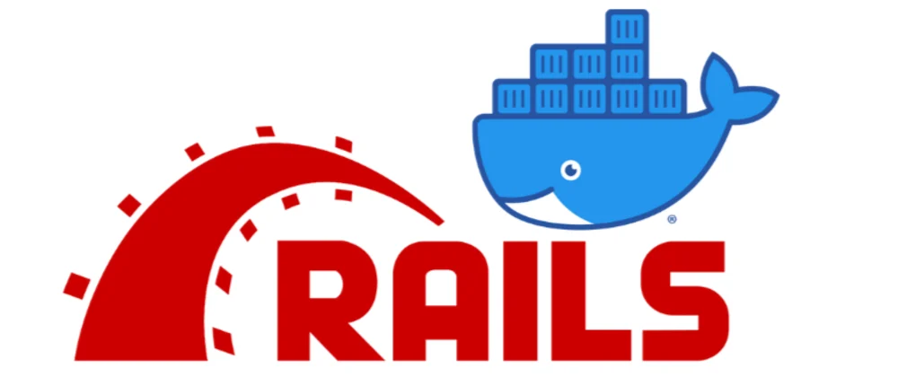

# docker-rails 🐳

## container

**web container** 
rails6.1.7

**db container** 
mysql8.0

## 環境構築方法
Rails の環境を構築したいディレクトリで `git clone` を行い、フォルダを作成する。
docker compose.yml ファイルがあるディレクトリで以下のコマンドを順に打つ

1. `docker-compose run web rails new . --force --database=mysql` コマンドでwebコンテナにRailsインストール
2. `docker-compose build` コマンドでイメージをビルドし直す
3. config/database.ymlをpassword: password、host: dbに変更
4. `docker-compose run web rails db:create` コマンドでdbコンテナにデータベース作成
5. `docker-compose up -d` コマンドでコンテナを作成
6. localhost:3000にアクセス
